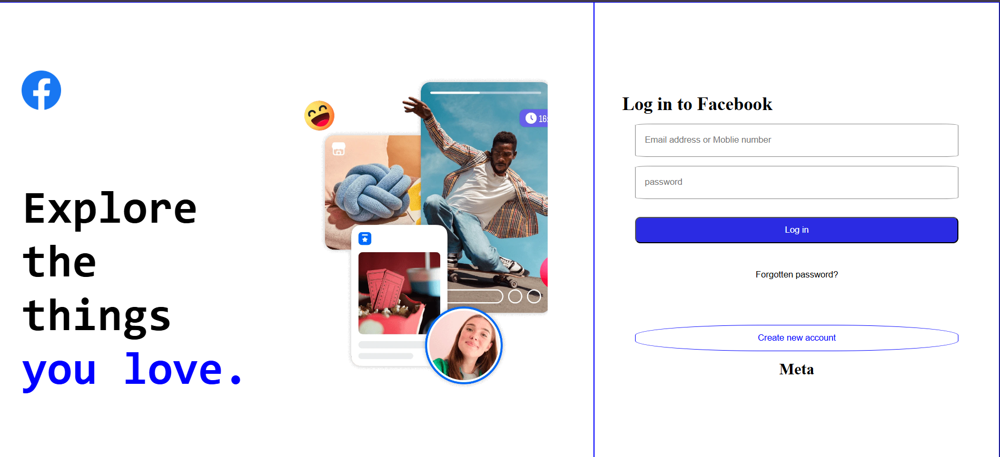
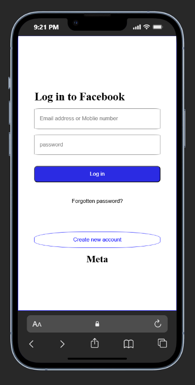

# Facebook Login Page Clone

A responsive Facebook-inspired login page built using **HTML5** and **CSS3** as my first frontend learning project.

This project was created to practice HTML page structure, CSS styling, Flexbox, responsive web design, forms, and media queries.

---

## Preview

### Desktop View



### Mobile View



---

## Features

- Responsive layout
- Facebook-inspired UI
- Login form
- Mobile-friendly design
- Background image section
- Clean and simple interface
- Built using only HTML & CSS

---

## Technologies Used

- HTML5
- CSS3
- Flexbox
- Media Queries

---

## Folder Structure

```
FACEBOOK_PAGE
│
├── facebook.html
├── facebook.css
├── README.md
│
└── images
    ├── facebook (1).png
    ├── facebook_background.webp
    ├── facebook-desktop.png
    └── facebook-mobile.png
```

---

## Learning Outcomes

Through this project I learned:

- HTML page structure
- CSS selectors
- Flexbox layout
- Responsive web design
- Media queries
- Forms and input fields
- Background images
- Basic UI development

---

## Future Improvements

- Add animations
- Improve accessibility
- Add JavaScript validation
- Improve UI styling
- Match the original Facebook page more closely

---

## Author

**Sachin K**

- GitHub: https://github.com/Sachin-K-0672
- LinkedIn: https://www.linkedin.com/in/sachin-k-3865a8380/
- Live Demo: https://sachin-k-dev-0672.netlify.app/

---

⭐ Thank you for visiting this repository!
